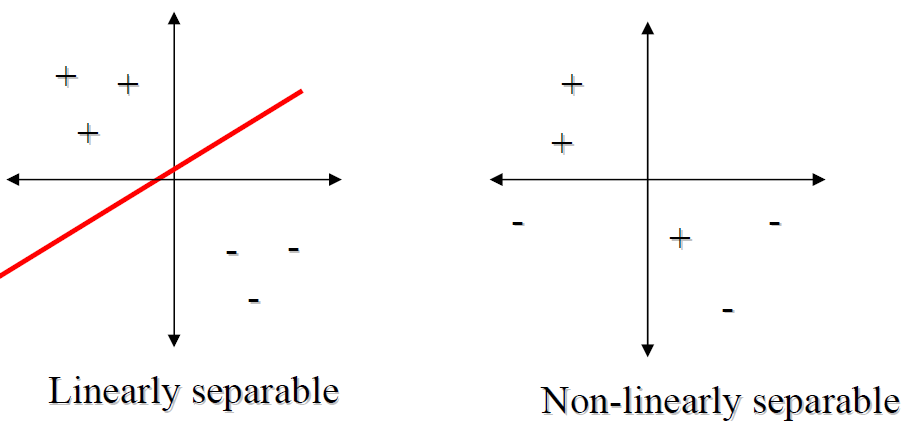

# Python-Perceptron

An Basic implementation of the perceptron, the build block a neural net.

## Usage

Clone the repo:

    git clone https://github.com/paolodelia99/Python-Perceptron.git
    
```python


```


## What is a Percepton

A percepton is a type of binary classifier. A binary classfier is a function
which can be decide weather or not an input, represented by a vector of numbers,
belong to a specific class. 

The perceptron maps its input **x** ( a real value vector ) to an output value **f(x)** ( a single binary value ):


where **w** is the vector of the weights with real value, **< , >** is the scalar product,
**b** is the bias,  a constant term that doesn't dipend on any input value and **χ(x)** is the output fuction, also called 
activation function. 
The most common choices for **χ(x)** are:

- **χ(x)** = **sing(x)**
- **χ(x)** = **Θ(x)**
- **χ(x)** = **x**

where Θ(x) is the Heavside Function.


The perceptron works weel when the learning set is linearly separable, while when the learning isn't linearly separable
its learning algorithm doesn't terminate. If the vector are not linearly separable will never reach a point where all vectors are 
classified properly. The most famous example of perceptron inability to solve problems with linearly separable vector is the 
boolean **XOR** problem.



## Author

Paolo D'Elia

## License 

MIT
